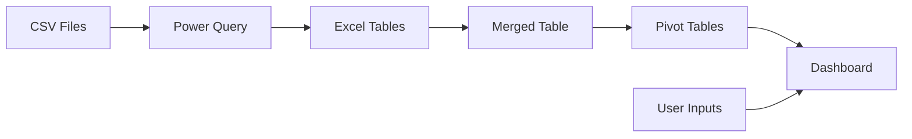

<h1 style="font-size: 2em; font-weight: bold;">Coffee Beans Sales Analysis</h1>

Last Updated: 2024-11-18  
Status: Completed

## 1. **Dashboard**

### 1.1. **Default View**

  
*Figure 1: Sales Overview dashboard showing sales trends, geographical distribution, and top customer performance across coffee types*

### 1.2. **Year-Filtered Views**

  
*Figure 2: Sales performance dashboard filtered to show 2019 data*

  
*Figure 3: Sales performance dashboard filtered to show 2020 data*

  
*Figure 4: Sales performance dashboard filtered to show 2021 data*

## 2. **Table of Contents**
- [1. **Dashboard**](#1-dashboard)
  - [1.1. **Default View**](#11-default-view)
  - [1.2. **Year-Filtered Views**](#12-year-filtered-views)
- [2. **Table of Contents**](#2-table-of-contents)
- [3. **Overview**](#3-overview)
- [4. **Project Requirements**](#4-project-requirements)
  - [4.1. **Requirements Email**](#41-requirements-email)
- [5. **User Requirements Analysis**](#5-user-requirements-analysis)
  - [5.1. **Project Overview**](#51-project-overview)
  - [5.2. **User Stories**](#52-user-stories)
- [6. **Technical Architecture**](#6-technical-architecture)
  - [6.1. **Data Sources**](#61-data-sources)
  - [6.2. **Data Flow**](#62-data-flow)
- [7. **Prerequisites**](#7-prerequisites)
- [8. **Dataset Description**](#8-dataset-description)
- [9. **Methodology**](#9-methodology)
  - [9.1. **Data Import and Preparation Process**](#91-data-import-and-preparation-process)
    - [9.1.1. **Data Import Strategy**](#911-data-import-strategy)
    - [9.1.2. **Data Standardization**](#912-data-standardization)
  - [9.2. **Data Integration**](#92-data-integration)
    - [9.2.1. **Orders Data Integration**](#921-orders-data-integration)
    - [9.2.2. **Customer Data Integration**](#922-customer-data-integration)
    - [9.2.3. **Product Data Integration**](#923-product-data-integration)
    - [9.2.4. **Type Name Expansion**](#924-type-name-expansion)
    - [9.2.5. **Sales Calculation**](#925-sales-calculation)
    - [9.2.6. **Date Format Standardization**](#926-date-format-standardization)
    - [9.2.7. **Final Table Structure**](#927-final-table-structure)
  - [9.3. **Initial Dashboard Preparation**](#93-initial-dashboard-preparation)
    - [9.3.1. **Pivot Tables**](#931-pivot-tables)
  - [9.4. **Building Main Dashboard**](#94-building-main-dashboard)
    - [9.4.1. **Interactive Dashboard Controls**](#941-interactive-dashboard-controls)
    - [9.4.2. **Main Dashboard Components**](#942-main-dashboard-components)
    - [9.4.3. **Dashboard Layout**](#943-dashboard-layout)
- [10. **Progress Updates**](#10-progress-updates)

## 3. **Overview**

This project examines coffee bean sales data to uncover business insights using Microsoft Excel. The analysis focuses on understanding sales patterns, customer purchasing trends, and product performance through data integration and analysis.

## 4. **Project Requirements**

### 4.1. **Requirements Email**

**Subject**: Coffee Sales Dashboard Project Requirements

Hi,

We need to upgrade our coffee bean sales analytics capabilities by transitioning from static reports to interactive visual dashboards.

Our focus areas are:
- Product performance tracking across coffee types and roast levels
- Customer segmentation and loyalty program analysis
- Geographic sales distribution
- Sales trends over time

We'll be analyzing sales patterns over a 48-month period.

Please let me know if you need any additional information.

Best regards,  
Sales Manager

## 5. **User Requirements Analysis**

### 5.1. **Project Overview**

- **Reporter:** Sales Manager
- **Value of Change:** Interactive dashboards for sales analysis
- **Necessary Systems:** Microsoft Excel, Power Query

### 5.2. **User Stories**

| ID  | Role          | Requirement                  | Business Value                     | Acceptance Criteria                       |
| --- | ------------- | ---------------------------- | ---------------------------------- | ----------------------------------------- |
| 1   | Sales Manager | Sales overview dashboard     | Track overall business performance | Dashboard with monthly/yearly filters     |
| 2   | Sales Manager | Regional sales visualization | Monitor country-level performance  | Bar chart showing sales by country        |
| 3   | Sales Rep     | Top customers view           | Identify top customers             | Bar chart of top 5 customers by sales     |
| 4   | Sales Rep     | Sales trend analysis         | Track performance over time        | Line chart with coffee type filter slicer |

## 6. **Technical Architecture**

### 6.1. **Data Sources**

- CSV Files (Orders, Customers, Products)
- Excel Data Tables

### 6.2. **Data Flow**


*Figure 5: Data flow diagram showing the transformation process from source CSV files through Power Query to final dashboard visualization*

## 7. **Prerequisites**

- Microsoft Excel 2016 or later
- Power Query enabled
- Basic Excel formula and data analysis knowledge

## 8. **Dataset Description**

Three core datasets track coffee sales:

- **Orders**: Transaction records of customer purchases
- **Customers**: Customer profiles and demographics
- **Products**: Coffee product specifications and pricing

The datasets link through `CustomerID` and `ProductID` keys.

## 9. **Methodology**

### 9.1. **Data Import and Preparation Process**

#### 9.1.1. **Data Import Strategy**

Import data using Power Query. While other methods work for these small datasets, Power Query provides the most efficient approach.

Format all datasets as tables rather than ranges to facilitate pivot table creation and updating later. Power Query handles this table formatting automatically.

Source files in the 'assets/data/source' folder:
- orders.csv 
- customers.csv
- products.csv

#### 9.1.2. **Data Standardization**

Implement standardization across two key areas:

**Field Naming Conventions**

Use these prefixes to identify field types:
- `Dt` - Date fields (Example: `DtOrder`)
- `FK` - Foreign keys (Example: `FK_CustomerID`) 
- `Amt` - Monetary values (Example: `AmtUnitPrice`)
- `Is/Has` - Boolean flags (Example: `HasLoyalty`)

**Data Type Configuration**

Set column names and data types for each table:

**Orders Table**
| Column Name     | Data Type    |
| --------------- | ------------ |
| `OrderID`       | Text         |
| `DtOrder`       | Date         |
| `FK_CustomerID` | Text         |
| `FK_ProductID`  | Text         |
| `Quantity`      | Whole Number |

  
*Figure 6: Power Query editor showing `Orders` table structure with configured data types*

**Customers Table**
| Column Name    | Data Type  |
| -------------- | ---------- |
| `CustomerID`   | Text       |
| `CustomerName` | Text       |
| `Email`        | Text       |
| `PhoneNumber`  | Text       |
| `AddressLine`  | Text       |
| `City`         | Text       |
| `Country`      | Text       |
| `PostCode`     | Text       |
| `HasLoyalty`   | True/False |

> **Note**: Convert `HasLoyalty` "Yes"/"No" values to TRUE/FALSE in Power Query.

  
*Figure 7: Power Query editor showing `Customers` table with standardized field names*

**Products Table**
| Column Name       | Data Type      |
| ----------------- | -------------- |
| `ProductID`       | Text           |
| `CoffeeType`      | Text           |
| `RoastType`       | Text           |
| `SizeKg`          | Decimal Number |
| `AmtUnitPrice`    | Currency       |
| `AmtPricePer100g` | Currency       |
| `AmtProfit`       | Currency       |

  
*Figure 8: Power Query editor showing `Products` table with configured data types and naming conventions*

### 9.2. **Data Integration**

Create a new sheet named `MergedTable`, and in it create a table with the same name. This table will combine necessary data from all three tables and serve as the foundation for all subsequent analysis and visualization work.

The merged table will contain 16 columns: `OrderID`, `DtOrder`, `FK_CustomerID`, `FK_ProductID`, `Quantity`, `CustomerName`, `Email`, `Country`, `HasLoyalty`, `CoffeeType`, `CoffeeTypeName`, `RoastType`, `RoastTypeName`, `SizeKg`, `AmtUnitPrice`, `AmtSales`

> **Note**: Some column names do not currently exist in our source tables. These will be populated using formulas later on.

#### 9.2.1. **Orders Data Integration**

All columns from the `Orders` table will be copied as is. Use table referencing formulas for the first 5 columns to copy everything from the `Orders` table into the `MergedTable`. For example:

```excel
=Orders[@OrderID]  # Repeat for first 5 columns
```

#### 9.2.2. **Customer Data Integration**

Integrate customer details using `FK_CustomerID` as the linking key. Apply these `XLOOKUP` formulas (or equivalent) to retrieve customer data:

```excel
# Get customer name
=XLOOKUP([@[FK_CustomerID]], Customers[CustomerID], Customers[CustomerName])

# Get customer email
=XLOOKUP([@[FK_CustomerID]], Customers[CustomerID], Customers[Email]) 

# Get customer country
=XLOOKUP([@[FK_CustomerID]], Customers[CustomerID], Customers[Country])

# Get loyalty status
=IF(XLOOKUP([@[FK_CustomerID]], Customers[CustomerID], Customers[HasLoyalty]), "Yes", "No")
```

#### 9.2.3. **Product Data Integration**

Integrate product details using `FK_ProductID` as the linking key. Start with this dynamic `INDEX-MATCH` formula for the `CoffeeType`:

```excel
=INDEX(Products,
    MATCH(MergedTable[@[FK_ProductID]:[FK_ProductID]], Products[[ProductID]:[ProductID]], 0),
    MATCH(MergedTable[[#Headers],[CoffeeType]], Products[#Headers], 0))
```

Formula breakdown:
- `INDEX(Products,...)` references the entire Products table range
- First `MATCH` finds the row position using absolute references
- Second `MATCH` finds the column position using relative references that update for each column

Copy and adapt this formula for remaining product-related columns (`RoastType`, `SizeKg`, `AmtUnitPrice`)

#### 9.2.4. **Type Name Expansion**

Add descriptive names for coffee and roast types by populating the two columns created earlier `CoffeeTypeName` and `RoastTypeName`:

**Coffee Type Names:**

Fill `CoffeeTypeName` using SWITCH to convert abbreviations in `CoffeeType` column to full names:
```excel
=SWITCH([@CoffeeType],
    "Rob", "Robusta",
    "Exc", "Excelsa", 
    "Ara", "Arabica",
    "Lib", "Liberica")
```

**Roast Type Names:**

Fill `RoastTypeName` to expand single-letter codes found in `RoastType` column:
```excel
=SWITCH([@RoastType],
    "L", "Light",
    "M", "Medium",
    "D", "Dark")
```

This expansion improves data readability (also useful in visualizations later on) by converting abbreviated codes to their full descriptive names.

#### 9.2.5. **Sales Calculation**

Calculate total sales in the `AmtSales` column by multiplying unit price by quantity:

```excel
=[@AmtUnitPrice] * [@Quantity]
```

#### 9.2.6. **Date Format Standardization**

Standardize `DtOrder` column to use international date format by applying custom date formatting (dd-mmm-yyyy):
```
Before: 9/5/2019
After:  05-Sep-2019

Format used: dd-mmm-yyyy
```

#### 9.2.7. **Final Table Structure**

| Field          | Sample Data       | Source/Note                     |
| -------------- | ----------------- | ------------------------------- |
| OrderID        | QEV-37451-860     | Orders                          |
| DtOrder        | 05-Sep-2019       | Orders (reformatted)            |
| FK_CustomerID  | 17670-51384-MA    | Orders                          |
| FK_ProductID   | R-M-1             | Orders                          |
| Quantity       | 2                 | Orders                          |
| CustomerName   | Aloisia Allner    | Customers lookup                |
| Email          | aallner0@lulu.com | Customers lookup (may be empty) |
| Country        | United States     | Customers lookup                |
| HasLoyalty     | Yes               | Customers lookup                |
| CoffeeType     | Rob               | Products lookup                 |
| CoffeeTypeName | Robusta           | Derived from CoffeeType         |
| RoastType      | M                 | Products lookup                 |
| RoastTypeName  | Medium            | Derived from RoastType          |
| SizeKg         | 1.00              | Products lookup                 |
| AmtUnitPrice   | $9.95             | Products lookup                 |
| AmtSales       | $19.90            | Calculated                      |

Final `MergedTable` table result:

| OrderID       | DtOrder     | FK_CustomerID  | FK_ProductID | Quantity | CustomerName     | Email                      | Country       | HasLoyalty | CoffeeType | CoffeeTypeName | RoastType | RoastTypeName | SizeKg | AmtUnitPrice | AmtSales |
| ------------- | ----------- | -------------- | ------------ | -------- | ---------------- | -------------------------- | ------------- | ---------- | ---------- | -------------- | --------- | ------------- | ------ | ------------ | -------- |
| QEV-37451-860 | 05-Sep-2019 | 17670-51384-MA | R-M-1        | 2        | Aloisia Allner   | aallner0@lulu.com          | United States | Yes        | Rob        | Robusta        | M         | Medium        | 1.00   | $9.95        | $19.90   |
| QEV-37451-860 | 05-Sep-2019 | 17670-51384-MA | E-M-0.5      | 5        | Aloisia Allner   | aallner0@lulu.com          | United States | Yes        | Exc        | Excelsa        | M         | Medium        | 0.50   | $8.25        | $41.25   |
| FAA-43335-268 | 17-Jun-2021 | 21125-22134-PX | A-L-1        | 1        | Jami Redholes    | jredholes2@tmall.com       | United States | Yes        | Ara        | Arabica        | L         | Light         | 1.00   | $12.95       | $12.95   |
| ...           |             |                |              |          |                  |                            |               |            |            |                |           |               |        |              |          |
| EZT-46571-659 | 02-Jan-2019 | 03396-68805-ZC | R-M-0.5      | 3        | Guthrey Petracci | gpetracci8@livejournal.com | United States | No         | Rob        | Robusta        | M         | Medium        | 0.50   | $5.97        | $17.91   |
| NWQ-70061-912 | 05-Sep-2019 | 61021-27840-ZN | R-M-0.5      | 1        | Rodger Raven     | rraven9@ed.gov             | United States | No         | Rob        | Robusta        | M         | Medium        | 0.50   | $5.97        | $5.97    |
| ...           |             |                |              |          |                  |                            |               |            |            |                |           |               |        |              |          |

> **Note**: Some records don't have email addresses, which is expected per the source data.

### 9.3. **Initial Dashboard Preparation**

#### 9.3.1. **Pivot Tables**

Create the following Pivot Tables from `MergedTable` with standardized settings:

Global settings for all tables:
- Each table on separate sheet matching table name
- `AmtSales` as SUM, formatted as USD with no decimals
- Tabular form layout
- Grand totals enabled for rows/columns
- Subtotals at bottom of groups

**Total Sales (`TotalSales`)**
- Rows > `Years (DtOrder)`, `Months (DtOrder)` 
- Columns > `CoffeeTypeName`
- Values > `AmtSales`

Sample output:
| Sum of AmtSales |                  | CoffeeTypeName |             |             |            |             |
| --------------- | ---------------- | -------------- | ----------- | ----------- | ---------- | ----------- |
| Years (DtOrder) | Months (DtOrder) | Arabica        | Excelsa     | Liberica    | Robusta    | Grand Total |
| 2019            | Jan              | $187           | $306        | $213        | $123       | $829        |
|                 | Feb              | $252           | $129        | $434        | $172       | $987        |
|                 | Mar              | $225           | $349        | $321        | $126       | $1,021      |
| ...             |                  |                |             |             |            |             |
| 2019 Total      |                  | $2,927         | $3,481      | $3,378      | $2,401     | $12,187     |
| ...             |                  |                |             |             |            |             |
| 2020            | Jul              | $431           | $227        | $236        | $415       | $1,309      |
|                 | Aug              | $23            | $78         | $61         | $140       | $300        |
| ...             |                  |                |             |             |            |             |
| 2020 Total      |                  | $3,356         | $3,663      | $2,604      | $2,493     | $12,118     |
| ...             |                  |                |             |             |            |             |
| **Grand Total** |                  | **$11,768**    | **$12,306** | **$12,054** | **$9,005** | **$45,134** |

**Monthly Sales (`SalesByMonth`)**
- Rows > `Months (DtOrder)`
- Values > `AmtSales`

Sample output:
| Months (DtOrder) | Sum of AmtSales |
| ---------------- | --------------- |
| Jan              | $3,503          |
| Feb              | $4,138          |
| Mar              | $4,796          |
| Apr              | $4,225          |
| May              | $3,248          |
| Jun              | $4,843          |
| Jul              | $3,983          |
| Aug              | $2,327          |
| Sep              | $3,634          |
| Oct              | $3,800          |
| Nov              | $3,548          |
| Dec              | $3,090          |
| **Grand Total**  | **$45,134**     |

> **Note**: Reference the Grand Total value in cell `B1` above the pivot table using: `=GETPIVOTDATA("AmtSales",SalesByMonth!$A$3)`. This value will be used later in the *total sales card*.

**Coffee Type Sales (`SalesByCoffeeType`)**
- Rows > `CoffeeTypeName`
- Values > `AmtSales`
- Sort > Ascending (A to Z) by `CoffeeTypeName`

Sample output:
| CoffeeTypeName  | Sum of AmtSales |
| --------------- | --------------- |
| Arabica         | $11,768         |
| Excelsa         | $12,306         |
| Liberica        | $12,054         |
| Robusta         | $9,005          |
| **Grand Total** | **$45,134**     |

**Country Sales (`SalesByCountry`)**
- Rows > `Country`
- Values > `AmtSales`
- Sort > Ascending by `Sum of AmtSales`

Sample output:
| Country         | Sum of AmtSales |
| --------------- | --------------- |
| United Kingdom  | $2,799          |
| Ireland         | $6,697          |
| United States   | $35,639         |
| **Grand Total** | **$45,134**     |

**Customer Sales (`SalesByCustomers`)**
- Rows > `CustomerName`
- Values > `AmtSales`
- Sort > Ascending by `Sum of AmtSales`
- Value Filter > Show Top 5 Items

Sample output:
| CustomerName    | Sum of AmtSales |
| --------------- | --------------- |
| Don Flintiff    | $278            |
| Nealson Cuttler | $282            |
| Terri Farra     | $289            |
| Brenn Dundredge | $307            |
| Allis Wilmore   | $317            |
| **Grand Total** | **$1,473**      |

### 9.4. **Building Main Dashboard**

#### 9.4.1. **Interactive Dashboard Controls**

Implement a set of slicers for filtering sales data by time period and product attributes.

This filtering system enables users to:
- Perform temporal trend analysis
- Compare product performance across different attributes
- Analyze customer loyalty impacts

> **Note**: All the following slicers maintain connections to every pivot table, with one exception: The `CoffeeType` slicer excludes the `SalesByCoffeeType` pivot table to preserve its ability to show comparative coffee type performance.

**Date Range Selection**

Configure two temporal filters (slicers) from the `TotalSales` pivot table:

| Slicer No. | Slicer Field       | Report Connections | Filters by      |
| ---------- | ------------------ | ------------------ | --------------- |
| 1          | `Years (DtOrder)`  | All pivot tables   | Specific years  |
| 2          | `Months (DtOrder)` | All pivot tables   | Specific months |

  
*Figure 9: Timeline controls showing year and month selection options for temporal analysis*

**Product Attribute Filters**

Configure four distinct slicers to filter by product characteristics:

| Slicer No. | Slicer Field    | Report Connections             | Filters by              |
| ---------- | --------------- | ------------------------------ | ----------------------- |
| 1          | `RoastTypeName` | All pivot tables               | Roast intensity         |
| 2          | `HasLoyalty`    | All pivot tables               | Customer loyalty status |
| 3          | `CoffeeType`    | All except `SalesByCoffeeType` | Bean type               |
| 4          | `SizeKg`        | All pivot tables               | Package size            |

  
*Figure 10: Product attribute slicers enabling multi-dimensional data analysis*

#### 9.4.2. **Main Dashboard Components**

Build the main dashboard components using a consistent color scheme. Use either Excel's built-in color palettes or create a custom theme.

Global Value Fields settings:
- Format all `AmtSales` as currency or percentage (based on visualization type) with no decimals

**Donut Chart: Sales By Coffee Type**

Create a donut chart from `SalesByCoffeeType` pivot table showing sales distribution by bean type:
- Axis > `CoffeeTypeName`
- Values > `Sum of AmtSales`

**Pie Chart: Sales By Country**

Create a pie chart from `SalesByCountry` pivot table showing percentage distribution by country:
- Axis > `Country`
- Values > `Sum of AmtSales`

  
*Figure 11: Two pie charts showing sales distribution by bean type and by country*

**Card: Total Sales**

Create a card-like visualization using the `SalesByMonth` pivot table:
1. Create area chart using:
   - Axis > `Months (DtOrder)`
   - Values > `Sum of AmtSales`
2. Remove all chart elements except title
3. Add text box with formula referencing Grand Total cell from `SalesByMonth` sheet

  
*Figure 12: Card-like visualizations showing total sales under different year filters*

**Line Chart: Total Sales over Time**

Create line chart from `TotalSales` pivot table showing sales trends:
- Axis > `Years (DtOrder)`, `Months (DtOrder)`
- Values > `Sum of AmtSales`

  
*Figure 13: Line chart showing sales trends by coffee type over time*

**Bar Chart: Sales by Country**

Create bar chart from `SalesByCountry` pivot table:
- Axis > `Country`
- Values > `Sum of AmtSales`

  
*Figure 14: Bar chart showing sales distribution by country*

**Bar Chart: Top Five Customers**

Create bar chart from `SalesByCustomers` pivot table:
- Axis > `CustomerName`
- Values > `Sum of AmtSales`

  
*Figure 15: Bar chart showing sales by top customers*

#### 9.4.3. **Dashboard Layout**

**Dashboard Frame Creation**
 - Create new sheet `Dashboard`
 - Add title rectangle `Coffee Beans Sales Overview`
 - Add short description under title
 - Apply consistent styling

**Element Arrangement**
 - Apply consistent margins
 - Ensure logical component placement
 - Maintain proper spacing

**Filter Synchronization**
 - Verify slicer connections
 - Test filter interactions
 - Confirm real-time updates

**Final Layout**

  
*See [Figure 1 (Complete Sales Overview)](#11-default-view)*

  
*See [Figure 2 (2019 Performance)](#12-year-filtered-views)*

  
*See [Figure 3 (2020 Performance)](#12-year-filtered-views)*

  
*See [Figure 4 (2021 Performance)](#12-year-filtered-views)*

## 10. **Progress Updates**

**2024-11-18**
- Enhanced dashboard visuals and color scheme
- Improved chart configurations
- Updated documentation with detailed instructions 
- Optimized visualization layouts
- Updated project folder structure

**2024-10-31**
- Validated data accuracy
- Implemented all visualizations
- Completed dashboard development

**2024-10-30**
- Created core pivot tables
- Developed initial charts

**2024-10-26**
- Received project requirements
- Identified data sources
- Mapped business needs
- Completed data import and cleaning