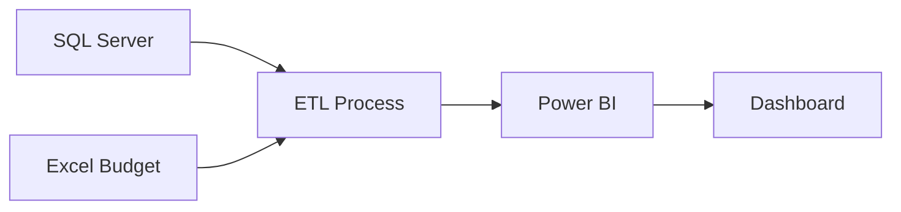
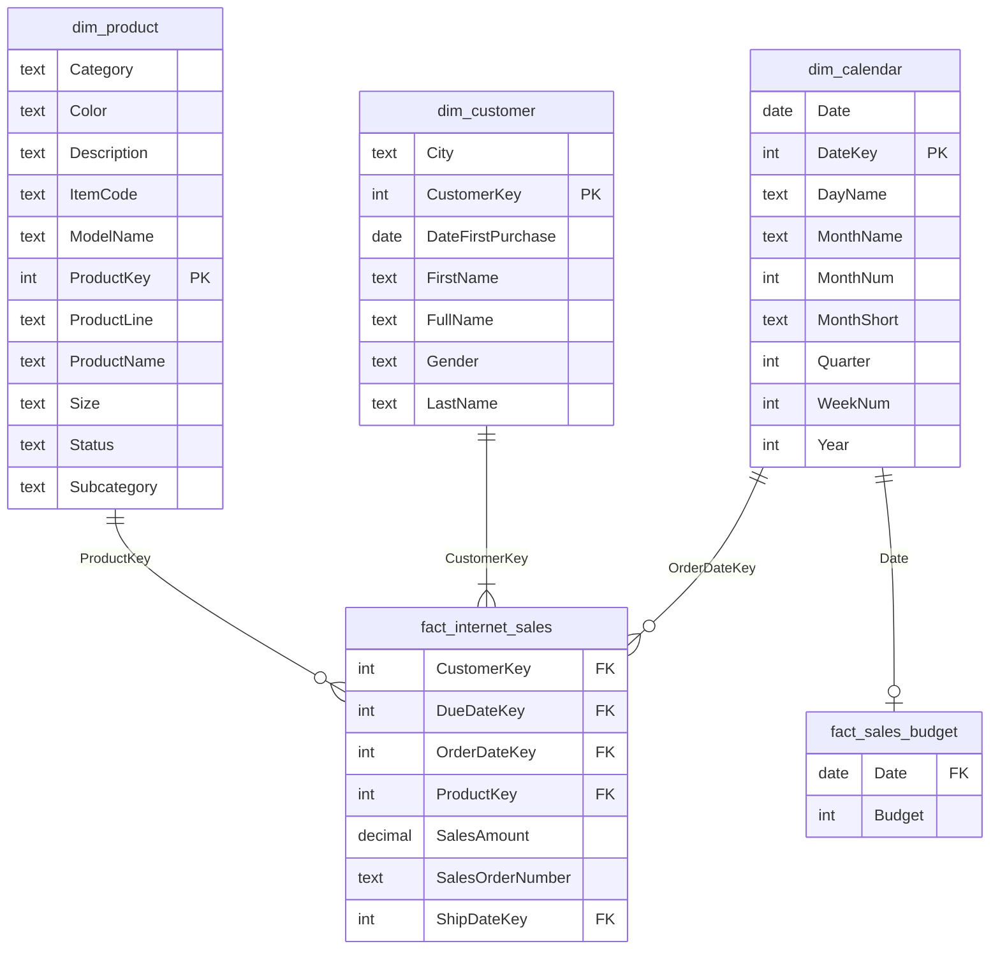

<h1 style="font-size: 2em; font-weight: bold;">Internet Sales Analytics</h1>

Last Updated: 2024-11-19  
Status: Completed

## 1. **Dashboards and Data Model**

### 1.1. **Sales Overview**
  
*Figure 1: Sales Overview dashboard showing KPIs, trend analysis, and geographical distribution of sales performance across product categories and top customers*

### 1.2. **Detail Pages**
  
*Figure 2: Customer Details view displaying individual customer performance metrics, monthly trends, and comparative analysis against budget targets*

  
*Figure 3: Product Details dashboard highlighting product-specific sales metrics, category performance, and monthly product sales analysis*

### 1.3. **Data Model**
  
*Figure 4: Star schema data model showing relationships between fact tables (Internet Sales, Sales Budget) and dimension tables (Calendar, Customer, Product), with one-to-many and one-to-one relationships clearly defined*

## 2. **Table of Contents**
- [1. **Dashboards and Data Model**](#1-dashboards-and-data-model)
  - [1.1. **Sales Overview**](#11-sales-overview)
  - [1.2. **Detail Pages**](#12-detail-pages)
  - [1.3. **Data Model**](#13-data-model)
- [2. **Table of Contents**](#2-table-of-contents)
- [3. **Overview**](#3-overview)
- [4. **Project Requirements**](#4-project-requirements)
  - [4.1. **Requirements Email**](#41-requirements-email)
- [5. **User Requirements Analysis**](#5-user-requirements-analysis)
  - [5.1. **Project Overview**](#51-project-overview)
  - [5.2. **User Stories**](#52-user-stories)
- [6. **Technical Architecture**](#6-technical-architecture)
  - [6.1. **Data Sources**](#61-data-sources)
  - [6.2. **Key Components**](#62-key-components)
  - [6.3. **Data Flow**](#63-data-flow)
- [7. **Prerequisites**](#7-prerequisites)
- [8. **Data Requirements Analysis**](#8-data-requirements-analysis)
  - [8.1. **Identifying Data Points**](#81-identifying-data-points)
  - [8.2. **Identifying Necessary Tables**](#82-identifying-necessary-tables)
    - [8.2.1. **Core Tables**](#821-core-tables)
    - [8.2.2. **Dimension Tables**](#822-dimension-tables)
    - [8.2.3. **External Data**](#823-external-data)
- [9. **Data Gathering and Cleaning**](#9-data-gathering-and-cleaning)
  - [9.1. **Calendar Dimension**](#91-calendar-dimension)
  - [9.2. **Customer Dimension**](#92-customer-dimension)
  - [9.3. **Product Dimension**](#93-product-dimension)
  - [9.4. **Internet Sales Fact Table**](#94-internet-sales-fact-table)
- [10. **Dashboard Preparation**](#10-dashboard-preparation)
  - [10.1. **Loading Data into Power BI**](#101-loading-data-into-power-bi)
  - [10.2. **Table Specifications**](#102-table-specifications)
    - [10.2.1. **Fact Tables**](#1021-fact-tables)
    - [10.2.2. **Dimension Tables**](#1022-dimension-tables)
  - [10.3. **Data Modeling**](#103-data-modeling)
    - [10.3.1. **Dimensional Model Structure**](#1031-dimensional-model-structure)
    - [10.3.2. **Relationship Details**](#1032-relationship-details)
  - [10.4. **Measures and Calculations**](#104-measures-and-calculations)
    - [10.4.1. **Core Sales Metrics**](#1041-core-sales-metrics)
    - [10.4.2. **Budget Analysis**](#1042-budget-analysis)
  - [10.5. **Dashboard Design**](#105-dashboard-design)
    - [10.5.1. **Data Preparation Requirements**](#1051-data-preparation-requirements)
    - [10.5.2. **Dashboard Components**](#1052-dashboard-components)
- [11. **Progress Updates**](#11-progress-updates)

## 3. **Overview**

This project implements advanced analytics for internet sales data using Microsoft's `AdventureWorksDW2019` database (SQL Server). The solution transforms static reporting into interactive visual dashboards, enabling data-driven decision-making for sales teams.

> **Note**: This documentation assumes you have updated the `AdventureWorksDW2019` database using the `Update_AdventureWorksDW_Data.sql` script (credit: `techtalkcorner`). The script uses the current year as its pivot point, so data dates will shift forward relative to your implementation date.

## 4. **Project Requirements**

### 4.1. **Requirements Email**

**Subject**: Internet Sales Dashboard Project Requirements

Hi,

I trust this email finds you well. We need to upgrade our **internet sales** analytics and transition from static reports to visual dashboards.

Our focus is to visualize our **product performance metrics**, identify our **key customer segments**, and track **sales trends over time**. Since each **team member** manages specific products and customers, we need the ability to **customize dashboard views** accordingly.

We measure our performance against **target metrics**, which I've included in the attached **budget forecast** for comparison. The budget covers 2024, and in our analysis, we typically look **24 months retrospectively** in time.

Please let me know if you need any additional information to proceed.

Best regards,
  
Sales Manager

## 5. **User Requirements Analysis**

### 5.1. **Project Overview**
- **Reporter:** Sales Manager
- **Value of Change:** Visual dashboards and improved sales reporting
- **Necessary Systems:** SQL Server, Power BI
- **Other Relevant Info:** Budgets have been delivered in Excel for 2024

### 5.2. **User Stories**

| ID  | Role                 | Requirement                                        | Business Value                                             | Acceptance Criteria                                                |
| --- | -------------------- | -------------------------------------------------- | ---------------------------------------------------------- | ------------------------------------------------------------------ |
| 1   | Sales Manager        | A dashboard overview of internet sales             | To identify top-performing customers and products          | A Power BI dashboard which updates data once a day                 |
| 2   | Sales Manager        | A dashboard overview of internet sales             | To track sales performance against budget over time        | A Power BI dashboard with graphs and KPIs comparing against budget |
| 3   | Sales Representative | A detailed overview of internet sales per customer | To identify high-volume customers and growth opportunities | A Power BI dashboard which allows filtering data for each customer |
| 4   | Sales Representative | A detailed overview of internet sales per product  | To track and analyze top-selling products                  | A Power BI dashboard which allows filtering data for each product  |

## 6. **Technical Architecture**

### 6.1. **Data Sources**
- SQL Server Database (DW)
- Excel Budget Forecasts

### 6.2. **Key Components**
1. **Fact Tables**
   - Internet Sales
   - Budget Data
2. **Dimension Tables**
   - Products
   - Customers
   - Time

### 6.3. **Data Flow**

*Figure 5: Data flow diagram showing the ETL process from source systems (SQL Server and Excel Budget) through transformation to final Power BI dashboard visualization*

## 7. **Prerequisites**
- SQL Server 2019+
- Power BI Desktop
- Access to AdventureWorks database
- Excel budget files

## 8. **Data Requirements Analysis**

### 8.1. **Identifying Data Points**

Based on the requirements email, we need to identify the following data points in our SQL Server database:

- **Internet Sales** - Need to locate fact table(s) containing sales numbers and metrics
- **Products** - Will require dimension table(s) with product descriptions and details
- **Clients** - Need to identify customer/client-related tables
- **Budget** - Available in provided Excel spreadsheet, will need to be incorporated as fact table

This initial analysis helps map business requirements to data sources and will guide our database exploration.

### 8.2. **Identifying Necessary Tables**

#### 8.2.1. **Core Tables**
- **`FactInternetSales`**
  - Primary fact table containing internet sales transactions
  - Contains key metrics and dimensional relationships

#### 8.2.2. **Dimension Tables**
- **`DimProduct`**
  - Product details and attributes
  - Supports product performance analysis
- **`DimCustomer`**
  - Customer demographics and attributes
  - Enables customer segmentation analysis
- **`DimDate`**
  - Time dimension for temporal analysis
  - Supports 24-month retrospective reporting

#### 8.2.3. **External Data**
- **`SalesBudget.xlsx`**
  - Excel file containing budget forecasts
  - Required for performance vs. target analysis

## 9. **Data Gathering and Cleaning**

Extraction and standardization of key dimensional and fact tables from `AdventureWorksDW2019` database for sales analysis.

### 9.1. **Calendar Dimension**

Prepare date dimension lookup table with standardized calendar attributes

**Purpose**: Create a clean date dimension with standardized naming conventions

**Tables**: `DimDate` (calendar dimension table)

> **Note**: Date attributes formatted for consistency:
>  - Day names in English 
>  - Month names abbreviated to 3 characters
>  - Date ranges filtered dynamically for 24-month retrospective analysis

**Query**:
```sql
USE [AdventureWorksDW2019]

SELECT
    [DateKey],
    [FullDateAlternateKey] AS [Date],
    [EnglishDayNameOfWeek] AS [DayName],
    [WeekNumberOfYear] AS [WeekNum],
    [EnglishMonthName] AS [MonthName],
    LEFT([EnglishMonthName], 3) AS [MonthShort],    /* Abbreviated month names for compact reporting */
    [MonthNumberOfYear] AS [MonthNum],
	[CalendarQuarter] AS [Quarter],
    [CalendarYear] AS [Year]
FROM
    [dbo].[DimDate]
    /* Dynamic filter for rolling 24-month analysis window */
WHERE
    [CalendarYear] >= YEAR(GETDATE()) - 2
ORDER BY
    [DateKey] ASC                                    /* Natural chronological order */
```

**Output Sample**:
| DateKey  | Date       | DayName  | WeekNum | MonthName | MonthShort | MonthNum | Quarter | Year |
| -------- | ---------- | -------- | ------- | --------- | ---------- | -------- | ------- | ---- |
| 20220101 | 2022-01-01 | Saturday | 1       | January   | Jan        | 1        | 1       | 2022 |
| 20220102 | 2022-01-02 | Sunday   | 2       | January   | Jan        | 1        | 1       | 2022 |
| ...      |            |          |         |           |            |          |         |      |
| 20221231 | 2022-12-31 | Saturday | 53      | December  | Dec        | 12       | 4       | 2022 |
| 20230101 | 2023-01-01 | Sunday   | 1       | January   | Jan        | 1        | 1       | 2023 |
| 20230102 | 2023-01-02 | Monday   | 1       | January   | Jan        | 1        | 1       | 2023 |
| ...      |            |          |         |           |            |          |         |      |

Save results as `dim_calendar.csv`

### 9.2. **Customer Dimension**

Extract and standardize customer demographics for sales analysis

**Purpose**: Create a clean customer dimension with geographical data and standardized gender values

**Tables**: `DimCustomer` (primary), `DimGeography` (location details)

> **Note**: Gender values expanded from M/F to Male/Female to enhance readability in sales analysis reports and dashboards. This makes gender-based sales breakdowns more intuitive for business users.

**Query**:
```sql
USE [AdventureWorksDW2019]

SELECT
    [c].[CustomerKey],
    [c].[FirstName],
    [c].[LastName],
    CONCAT([c].[FirstName], ' ', [c].[LastName]) AS [FullName],
    CASE [c].[Gender]
        WHEN 'M' THEN 'Male'
        WHEN 'F' THEN 'Female'
    END AS [Gender],
    [c].[DateFirstPurchase],
    [g].[City] AS [City]         /* City data included for regional analysis requirements */
FROM
    [dbo].[DimCustomer] AS [c]
    /* Using LEFT JOIN to retain all customers, even those without location data */
    LEFT JOIN [dbo].[DimGeography] AS [g] 
        ON [c].[GeographyKey] = [g].[GeographyKey]
ORDER BY
    [c].[CustomerKey] ASC        /* Default sort by primary key for consistent output */
```

**Output Sample**:
| CustomerKey | FirstName | LastName | FullName          | Gender | DateFirstPurchase | City        |
| ----------- | --------- | -------- | ----------------- | ------ | ----------------- | ----------- |
| 11000       | Jon       | Yang     | Jon Yang          | Male   | 2021-01-19        | Rockhampton |
| 11001       | Eugene    | Huang    | Eugene Huang      | Male   | 2021-01-15        | Seaford     |
| 11002       | Ruben     | Torres   | Ruben Torres      | Male   | 2021-01-07        | Hobart      |
| 11003       | Christy   | Zhu      | Christy Zhu       | Female | 2020-12-29        | North Ryde  |
| 11004       | Elizabeth | Johnson  | Elizabeth Johnson | Female | 2021-01-23        | Wollongong  |
| ...         |           |          |                   |        |                   |             |

Save results as `dim_customer.csv`

### 9.3. **Product Dimension**

Extract and standardize product dimension for sales analysis

**Purpose**: Create a comprehensive product lookup table with category classifications

**Tables**: `DimProduct` (primary), `DimProductSubcategory`, `DimProductCategory`

> **Note**: Selected columns support various analytical scenarios:
>  - Product categorization (Category -> Subcategory -> Product)
>  - Product attributes (Color, Size, Line, Model)
>  - Product status with default handling for NULL values

This selection enables multi-level product performance analysis and segmentation.

**Query**:
```sql
USE [AdventureWorksDW2019]

SELECT
   [pd].[ProductKey],
   [pd].[ProductAlternateKey] AS [ItemCode],
   [pd].[EnglishProductName] AS [ProductName],
   [ps].[EnglishProductSubcategoryName] AS [Subcategory],    /* For subcategory-level analysis */
   [pc].[EnglishProductCategoryName] AS [Category],          /* For category-level analysis */
   [pd].[Color],                                             /* Product attributes for segmentation */
   [pd].[Size],
   [pd].[ProductLine],
   [pd].[ModelName],
   [pd].[EnglishDescription] AS [Description],
   ISNULL([pd].[Status], 'Outdated') AS [Status]            /* Default 'Outdated' for NULL status */
FROM
   [dbo].[DimProduct] AS [pd]
   /* Maintain all products even without subcategory assignments */
   LEFT JOIN [dbo].[DimProductSubcategory] AS [ps] 
       ON [pd].[ProductSubcategoryKey] = [ps].[ProductSubcategoryKey]
   /* Maintain all products even without category assignments */
   LEFT JOIN [dbo].[DimProductCategory] AS [pc] 
       ON [ps].[ProductCategoryKey] = [pc].[ProductCategoryKey]
ORDER BY
   [pd].[ProductKey] ASC                                     /* Default sort by primary key */
```

**Output Sample**:
| ProductKey | ItemCode   | ProductName               | Subcategory | Category    | Color | Size | ProductLine | ModelName     | Description | Status  |
| ---------- | ---------- | ------------------------- | ----------- | ----------- | ----- | ---- | ----------- | ------------- | ----------- | ------- |
| 1          | AR-5381    | Adjustable Race           | NULL        | NULL        | NA    | NULL | NULL        | NULL          | NULL        | Current |
| 2          | BA-8327    | Bearing Ball              | NULL        | NULL        | NA    | NULL | NULL        | NULL          | NULL        | Current |
| ...        |            |                           |             |             |       |      |             |               |             |         |
| 210        | FR-R92B-58 | HL Road Frame - Black, 58 | Road Frames | Components  | Black | 58   | R           | HL Road Frame | ...         | Current |
| 211        | FR-R92R-58 | HL Road Frame - Red, 58   | Road Frames | Components  | Red   | 58   | R           | HL Road Frame | ...         | Current |
| 212        | HL-U509-R  | Sport-100 Helmet, Red     | Helmets     | Accessories | Red   | NULL | S           | Sport-100     | ...         | Outdate |
| ...        |            |                           |             |             |       |      |             |               |             |         |

Save results as `dim_product.csv`

### 9.4. **Internet Sales Fact Table**

Extract internet sales transactions for analysis

**Purpose**: Create a clean fact table of internet sales with key metrics and dimensions

**Tables**: `FactInternetSales` (transaction data)

> **Note**: Data filtered for last 24 months of sales activity to support current analysis requirements and align with business reporting needs. Includes key relationships to customer, product, and date dimensions.

**Query**:
```sql
USE [AdventureWorksDW2019]

SELECT
   [ProductKey],                    /* Links to product dimension */
   [OrderDateKey],                  /* Links to date dimension */
   [DueDateKey],                    /* For delivery performance analysis */
   [ShipDateKey],                   /* For shipping performance analysis */
   [CustomerKey],                   /* Links to customer dimension */
   [SalesOrderNumber],              /* Unique transaction identifier */
   [SalesAmount]                    /* Primary sales metric */
FROM
   [dbo].[FactInternetSales]
WHERE
   LEFT([OrderDateKey], 4) >= YEAR(GETDATE()) - 2    /* Rolling 24-month analysis window */
ORDER BY
   [OrderDateKey] ASC                                 /* Chronological order */
```

**Output Sample**:
| ProductKey | OrderDateKey | DueDateKey | ShipDateKey | CustomerKey | SalesOrderNumber | SalesAmount |
| ---------- | ------------ | ---------- | ----------- | ----------- | ---------------- | ----------- |
| 381        | 20220101     | 20220113   | 20220108    | 16942       | SO46700          | 1000.4375   |
| 375        | 20220101     | 20220113   | 20220108    | 15114       | SO46701          | 2181.5625   |
| ...        |              |            |             |             |                  |             |
| 214        | 20221231     | 20230112   | 20230107    | 25625       | SO51246          | 34.99       |
| 361        | 20230101     | 20230113   | 20230108    | 11249       | SO51247          | 2294.99     |
| 477        | 20230101     | 20230113   | 20230108    | 11249       | SO51247          | 4.99        |
| ...        |              |            |             |             |                  |             |

Save results as `fact_internet_sales.csv`

## 10. **Dashboard Preparation**

This section describes the data loading process and structure for the Power BI dashboard implementation.

### 10.1. **Loading Data into Power BI**

1. **Import Data Sources**
   - Import CSV files exported from SQL Server database:
     - `dim_calendar.csv`
     - `dim_customer.csv`
     - `dim_product.csv`
     - `fact_internet_sales.csv`
   - Import budget data:
     - Table `Budget` from `SalesBudget.xlsx` > rename to `fact_sales_budget`

2. **Data Type Configuration**
   - Power Query automatically detects appropriate data types
   - Verify data type assignments match specifications below

3. **Query Organization**
   - Organize queries into logical groups for better maintenance
   - Structure follows dimensional modeling best practices

```
📁 Queries [5]  
├─📁 Facts [2]  
│ ├─🔲 fact_internet_sales  
│ └─🔲 fact_sales_budget  
├─📁 Dimensions [3]  
│ ├─🔲 dim_calendar  
│ ├─🔲 dim_customer  
│ └─🔲 dim_product  
└─📁 Other Queries  
```

### 10.2. **Table Specifications**

#### 10.2.1. **Fact Tables**

- **`fact_internet_sales`** - Internet sales transactions
  | Column           | Data Type      | Description                 |
  | ---------------- | -------------- | --------------------------- |
  | ProductKey       | Whole Number   | Foreign key to dim_product  |
  | OrderDateKey     | Whole Number   | Foreign key to dim_calendar |
  | DueDateKey       | Whole Number   | Foreign key to dim_calendar |
  | ShipDateKey      | Whole Number   | Foreign key to dim_calendar |
  | CustomerKey      | Whole Number   | Foreign key to dim_customer |
  | SalesOrderNumber | Text           | Unique order identifier     |
  | SalesAmount      | Decimal Number | Transaction amount          |

- **`fact_sales_budget`** - Sales targets
  | Column | Data Type    | Description   |
  | ------ | ------------ | ------------- |
  | Date   | Date         | Budget date   |
  | Budget | Whole Number | Target amount |

#### 10.2.2. **Dimension Tables**

- **`dim_calendar`** - Date dimension
  | Column     | Data Type    | Description         |
  | ---------- | ------------ | ------------------- |
  | DateKey    | Whole Number | Primary key         |
  | Date       | Date         | Full date           |
  | DayName    | Text         | Day of week         |
  | WeekNum    | Whole Number | Week number (1-53)  |
  | MonthName  | Text         | Full month name     |
  | MonthShort | Text         | 3-letter month      |
  | MonthNum   | Whole Number | Month number (1-12) |
  | Quarter    | Whole Number | Quarter (1-4)       |
  | Year       | Whole Number | Calendar year       |

- **`dim_customer`** - Customer information
  | Column            | Data Type    | Description            |
  | ----------------- | ------------ | ---------------------- |
  | CustomerKey       | Whole Number | Primary key            |
  | FirstName         | Text         | Customer first name    |
  | LastName          | Text         | Customer last name     |
  | FullName          | Text         | Combined name          |
  | Gender            | Text         | Customer gender        |
  | DateFirstPurchase | Date         | First transaction date |
  | City              | Text         | Customer city          |

- **`dim_product`** - Product catalog
  | Column      | Data Type    | Description         |
  | ----------- | ------------ | ------------------- |
  | ProductKey  | Whole Number | Primary key         |
  | ItemCode    | Text         | Product SKU         |
  | ProductName | Text         | Product name        |
  | Subcategory | Text         | Product subcategory |
  | Category    | Text         | Product category    |
  | Color       | Text         | Product color       |
  | Size        | Text         | Product size        |
  | ProductLine | Text         | Product line        |
  | ModelName   | Text         | Model name          |
  | Description | Text         | Product description |
  | Status      | Text         | Product status      |

### 10.3. **Data Modeling**

The data model follows a star schema design optimized for analytical queries and reporting. This section details the dimensional model structure and relationships.

#### 10.3.1. **Dimensional Model Structure**

The model consists of three dimension tables and two fact tables, organized in a star schema pattern:

  
*See [Figure 4 (Data Model)](#13-data-model)*

> **Note**: The `msr_sales` table shown in the diagram will be implemented in the Measures and Calculations section.


*Figure 6: Entity Relationship Diagram (ERD) showing the star schema design with `fact_internet_sales` and `fact_sales_budget` as fact tables, connected to dimension tables (`dim_calendar`, `dim_customer`, `dim_product`). The diagram illustrates table structures with their columns and data types, as well as cardinality relationships between tables.*

#### 10.3.2. **Relationship Details**

- **Calendar Dimension (`dim_calendar`)**
  - **To Internet Sales Relationship**
    | Aspect        | Description                               |
    | ------------- | ----------------------------------------- |
    | Type          | One-to-Many                               |
    | Cardinality   | One date to zero or many sales            |
    | Ordinality    | Optional (dates may exist without sales)  |
    | Business Rule | Each sale must reference exactly one date |

  - **To Sales Budget Relationship**
    | Aspect        | Description                                       |
    | ------------- | ------------------------------------------------- |
    | Type          | One-to-Zero-or-One                                |
    | Cardinality   | One date to zero or one budget entry              |
    | Ordinality    | Optional (dates may exist without budget entries) |
    | Business Rule | Each date can have at most one budget entry       |

- **Customer Dimension (`dim_customer`)**
  | Aspect        | Description                                                       |
  | ------------- | ----------------------------------------------------------------- |
  | Type          | One-to-Many                                                       |
  | Cardinality   | One customer to one or many sales                                 |
  | Ordinality    | Mandatory (customers must have at least one sale)                 |
  | Business Rule | Each sale must be associated with exactly one customer            |
  | Key Structure | `CustomerKey` as primary key, referenced by `fact_internet_sales` |

- **Product Dimension (`dim_product`)**
  | Aspect        | Description                                                      |
  | ------------- | ---------------------------------------------------------------- |
  | Type          | One-to-Many                                                      |
  | Cardinality   | One product to zero or many sales                                |
  | Ordinality    | Optional (products may exist without sales)                      |
  | Business Rule | Each sale must reference exactly one product                     |
  | Key Structure | `ProductKey` as primary key, referenced by `fact_internet_sales` |

### 10.4. **Measures and Calculations**

This section documents the key measures implemented in the data model, along with their business context and technical implementation details.

> **Note**: Create all measures in dedicated measure table named `msr_sales`

#### 10.4.1. **Core Sales Metrics**

- **`TotalSales`**

  ```dax
  TotalSales = 
      SUM(fact_internet_sales[SalesAmount])
  ```
  - **Purpose**: Aggregates total sales across transactions
  - **Format**: Currency, whole numbers

#### 10.4.2. **Budget Analysis**

- **`TotalBudget`**

  ```dax
  TotalBudget = 
      SUM(fact_sales_budget[Budget])
  ```
  - **Purpose**: Calculates budget targets for period
  - **Format**: Currency, whole numbers

- **`KPIStatus`**

  ```dax
  KPIStatus =
  VAR CurrentSales = [TotalSales]
  VAR TargetSales = [TotalBudget]
  RETURN
      SWITCH(
          TRUE(),
          ISBLANK(CurrentSales) || ISBLANK(TargetSales), 0,    // No data
          CurrentSales >= TargetSales, 1,                       // At/above target
          -1                                                    // Below target
      )
  ```
  - **Purpose**: KPI status indicator for visualizations
  - **Format**: Integer (-1, 0, 1)

### 10.5. **Dashboard Design**

The dashboard suite consists of three views providing comprehensive sales analysis capabilities.

#### 10.5.1. **Data Preparation Requirements**

Configure the following columns (using column tools) as follows:

- **`dim_customer[City]`**
  - Data Category > `City`
  - **Purpose**: Mapping enablement

- **`dim_calendar[MonthShort]`**
  - Sort by column > `MonthNum`
  - **Purpose**: Ensure chronological month ordering

#### 10.5.2. **Dashboard Components**

**1. Sales Overview Dashboard**

*Primary dashboard providing high-level sales performance metrics and trends*

**Global Filters**
| Filter Type | Field                        | Style        | Notes                        |
| ----------- | ---------------------------- | ------------ | ---------------------------- |
| Time Period | `MonthShort`, `Year`         | Dropdown     | Dual-axis temporal filtering |
| Geography   | `City`                       | Dropdown     | Location-based filtering     |
| Product     | `ProductName`, `Subcategory` | Dropdown     | Product hierarchy filtering  |
| Category    | `Category`                   | Cards (Grid) | High-level product grouping  |

**Visualizations**
| Chart Type       | Purpose                | Key Metrics                   | Configuration                 |
| ---------------- | ---------------------- | ----------------------------- | ----------------------------- |
| Donut Chart      | Category Distribution  | `TotalSales`                  | Group by Product Category     |
| Stacked Bar (x2) | Top Performers         | `TotalSales`                  | Top 10 Customers/Products     |
| Gauge            | KPI Tracking           | `TotalSales` vs `TotalBudget` | Target performance monitoring |
| Line Chart       | Trend Analysis         | `TotalSales`, `TotalBudget`   | Monthly comparison            |
| Map              | Geographic Performance | `TotalSales`                  | Bubble size by sales volume   |

  
*See [Figure 1 (Sales Overview)](#11-sales-overview)*

**2. Customer Analysis Dashboard**

*Detailed customer performance metrics and temporal analysis*

**Retained Components**
- All global filters
- Top 10 customers bar chart
- Sales vs budget trend line

**New Components**
| Element         | Type  | Configuration                                                     | Purpose                       |
| --------------- | ----- | ----------------------------------------------------------------- | ----------------------------- |
| KPI Cards       | Card  | `TotalSales`, `TotalBudget`                                       | At-a-glance metrics           |
| Customer Matrix | Table | Rows: `FullName`<br>Columns: `MonthShort`<br>Values: `TotalSales` | Detailed customer performance |

  
*See [Figure 2 (Customer Details)](#12-detail-pages)*

**3. Product Analysis Dashboard**

*Product-focused performance analysis*

**Modified Components**
| Element              | Original           | Modified          | Purpose                       |
| -------------------- | ------------------ | ----------------- | ----------------------------- |
| Performance Table    | Customer Matrix    | Product Matrix    | Product-centric analysis      |
| Top Performers Chart | Customer Bar Chart | Product Bar Chart | Product ranking visualization |

**Configuration Details**
- Matrix Configuration
  - Rows > `ProductName`
  - Columns > `MonthShort`
  - Values > `TotalSales`
- Retained all other elements from Customer Analysis Dashboard

  
*See [Figure 3 (Product Details)](#12-detail-pages)*

## 11. **Progress Updates**

**2024-11-19**
- Updated documentation with minor formatting changes

**2024-11-09**
- Completed Power BI data loading process
- Implemented star schema data model with proper relationships
- Created core sales and budget measures
- Configured geographical data settings for mapping
- Completed comprehensive dashboard design documentation
- Established performance monitoring guidelines
- Defined dashboard suite architecture and components

**2024-11-03**
- Completed identification of necessary tables in the database
- Extracted required data from identified tables
- Generated clean output files for analysis
- Validated data quality and completeness
- Created standardized naming conventions

**2024-11-01**
- Received initial requirements from Sales Manager
- Identified key business metrics needed
- Started mapping data requirements to available sources
- Established project timeline and milestones
- Created initial project documentation structure